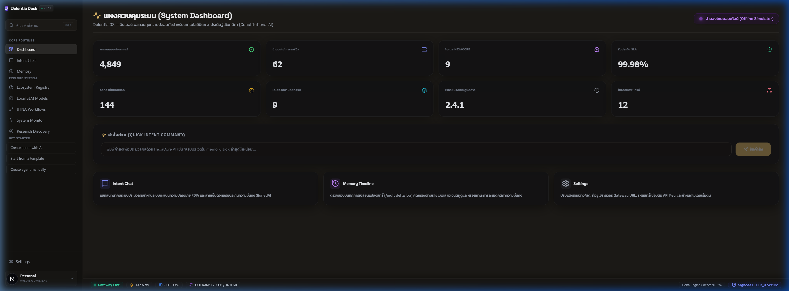
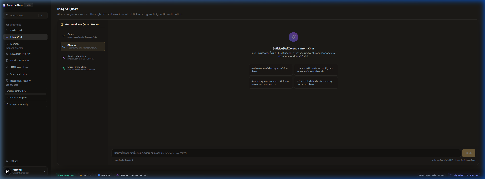
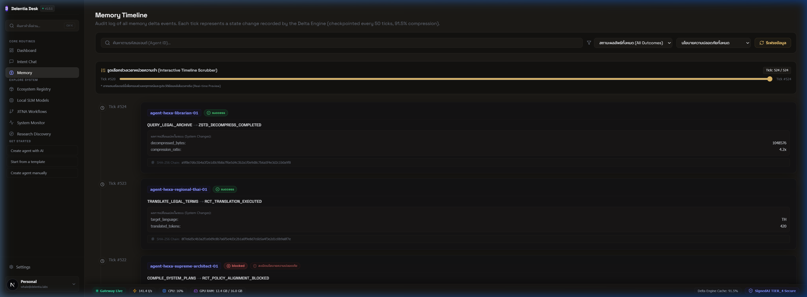
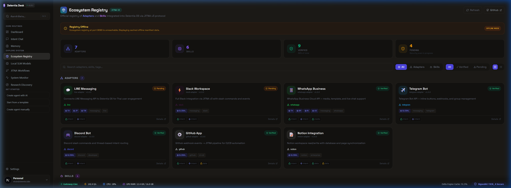
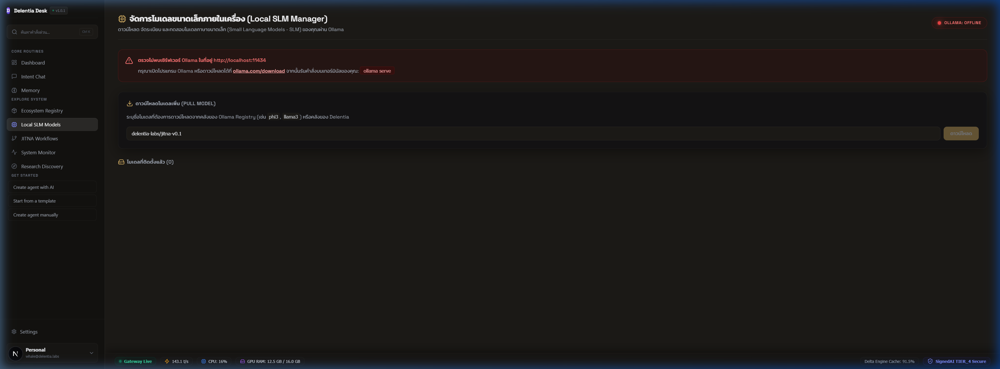
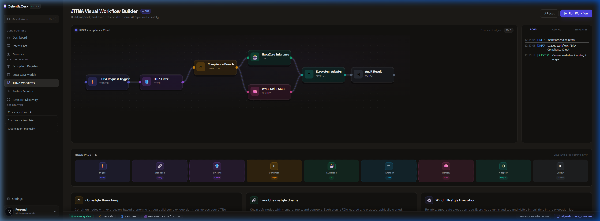
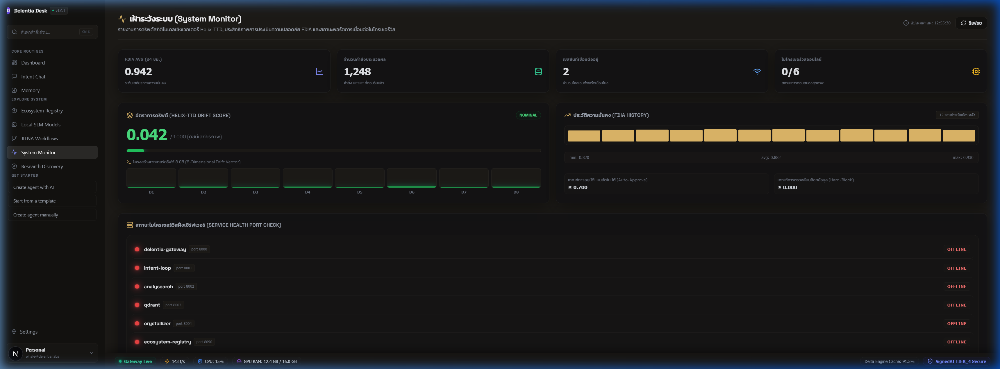
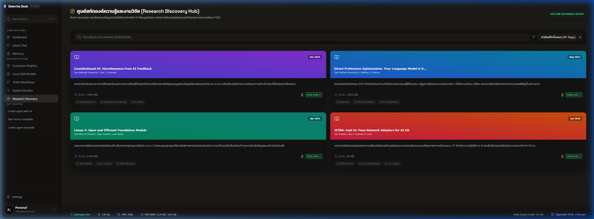
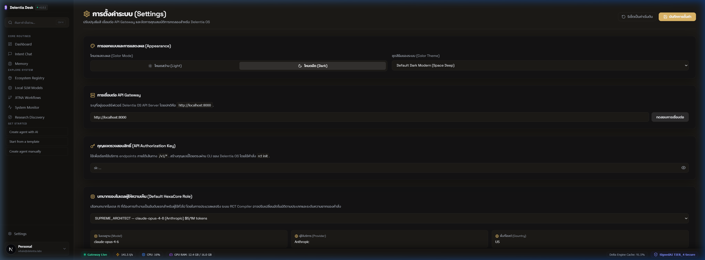

# Delentia Desk — Enterprise Visual Control Surface

> **Enterprise Visual Control Surface & Security Monitor** for **Delentia OS** — built with **Tauri v2** + **Next.js 15** + **Tailwind CSS**.
>
> แผงควบคุมภาพและตรวจสอบมิติความปลอดภัยระดับองค์กรสำหรับ **Delentia OS** ขับเคลื่อนด้วยสถาปัตยกรรม **Tauri v2** ร่วมกับ **Next.js 15** และ **Tailwind CSS**

<p align="center">
  <a href="#-english">🇺🇸 English Description</a> •
  <a href="#-ภาษาไทย">🇹🇭 คำอธิบายภาษาไทย</a>
</p>

<p align="center">
  
  <a href="https://github.com/delentia-labs/delentia-gui/releases"></a>
  <a href="https://nextjs.org"></a>
  <a href="https://tauri.app"></a>
  <a href="LICENSE"></a>
</p>

---

## 🇺🇸 English

### Introduction
**Delentia Desk** is the official desktop application for **Delentia OS**. It serves as an advanced visual control surface for Intent-Centric Constitutional AI.

By communicating directly with the **Delentia OS Gateway** (port `8000`), the client displays real-time health diagnostics, manages agent orchestration via **JITNA Workflows**, tracks and rolls back memory checkpoints with the **Delta Engine**, and evaluates model safety via **FDIA Verification** ($F = D^I \times A$) and **SignedAI Consensus**.

---

### 📸 Screenshots & Modules

The application is structured into 9 core routes, each representing a key administrative panel:

#### 1. System Dashboard (`/`)
An executive summary panel displaying critical system metrics (tests passed, microservice count, SLA rates, and active models) alongside the **Quick Intent Command Bar** to send live prompt executions to the core kernel.


#### 2. Intent Chat (`/chat`)
A custom chat room where prompts are analyzed, classified, and processed by the front-end HexaCore models with live **FDIA safety badges** and **SignedAI attestation flags**.


#### 3. Memory Timeline (`/memory`)
An audit log visualizer tracking state changes in the **Delta Engine**. Users can scroll through the history scrubber and trigger a state **Rollback** to any past tick with double-confirmation safety.


#### 4. Ecosystem Registry (`/ecosystem`)
A registry dashboard detailing connected adapters, database connectors (such as Qdrant), and search modules (arXiv, patent databases) to configure active skills.


#### 5. Local SLM Models (`/models`)
A downloader and connection diagnostics hub for offline-capable Small Language Models (SLMs) running locally via Ollama (e.g., `typhoon-v2-7b`, `llama3-8b`).


#### 6. JITNA Workflows (`/workflow`)
An interactive node-based workflow builder (Alpha) allowing operators to chain triggers, logic gates, AI nodes, and security filters into automated JITNA fleets.


#### 7. System Monitor (`/monitor`)
A deep diagnostic dashboard tracking model drift, FDIA safety evaluations over time, request latency, and microservices port check metrics.


#### 8. Research Discovery (`/discovery`)
A real-time search interface linked to arXiv, evaluating the constitutional safety alignment of machine learning academic papers before indexing.


#### 9. Settings (`/settings`)
An administrative control center to configure general parameters, API keys, gateway endpoints, active LLM role selection, and switch between 27 premium UI themes.


---

### ⚙️ Key Features
* **Enterprise Theme Engine:** Choose from 27 pre-configured styles (e.g., PowerShell ISE, Monokai, Tokyo Night) with robust hydration flicker protection.
* **Delta Engine Timeline Rollback:** Secure state management with the ability to revert system data back to any past memory checkpoint.
* **Unified Security Interface:** Continuous visualization of FDIA scoring and cryptographic SignedAI consensus status.
* **Tauri v2 Optimization:** Extremely fast startup, native rendering, and a tiny memory footprint.

---

### 🛠️ System Architecture

```
┌─────────────────────────────────────────────────────────────┐
│                      Delentia Desk (Tauri v2)               │
│  ┌─────────────────────────────────────────────────────┐    │
│  │  Next.js 15 (Static HTML Export) — src/app/         │    │
│  │  ├── 9 Routes (Dashboard, Chat, Memory, Ecosystem, │    │
│  │  │   Models, Workflows, Monitors, Discovery, Settings)│    │
│  └──────────────────────┬──────────────────────────────┘    │
│                         │ Tauri IPC & Commands              │
│  ┌──────────────────────▼──────────────────────────────┐    │
│  │  Rust Backend (src-tauri/)                           │    │
│  │  ├── execute_intent()     → POST /v1/kernel/execute │    │
│  │  ├── get_system_stats()   → GET  /delentia/system/stats│ │
│  │  ├── health_check()       → GET  /health             │    │
│  │  └── get_memory_history() → GET  /v1/memory/history │    │
│  └──────────────────────┬──────────────────────────────┘    │
│                         │ reqwest (HTTPS/WSS)               │
└─────────────────────────┼───────────────────────────────────┘
                          ▼
          Delentia OS Gateway  (localhost:8000)
```

---

### 🚀 Quick Start

#### 1. Prerequisites
* **Node.js:** $\ge 20$
* **Rust:** Stable Channel (required for compiling the Tauri binary)
* **OS-Specific Packages:**
  * *Windows:* WebView2 Runtime (pre-installed on Win 11).
  * *Linux:* `sudo apt-get install -y libwebkit2gtk-4.1-dev libgtk-3-dev libayatana-appindicator3-dev librsvg2-dev`

#### 2. Development Mode
```bash
# Clone the repository
git clone https://github.com/delentia-labs/delentia-gui
cd delentia-gui

# Create environment configuration
cp .env.example .env.local

# Install dependencies
npm install

# Run the Tauri desktop window with Hot Reloading
npm run tauri:dev
```

#### 3. Web-only Mode (Next.js in Browser)
```bash
npm run dev
```
Open your browser at **`http://localhost:3000`**.

#### 4. Compilation & Build
```bash
# Compile and build the installer package for your current OS
npm run tauri:build
```
Build outputs are located at `src-tauri/target/release/bundle/`.

---

## 🇹🇭 ภาษาไทย

### บทนำ
**Delentia Desk** คือเดสก์ท็อปแอปพลิเคชันอย่างเป็นทางการสำหรับ **Delentia OS** ทำหน้าที่เป็นหน้าต่างควบคุมเชิงภาพ (Visual Control Surface) สำหรับระบบปัญญาประดิษฐ์เชิงกติกา (Constitutional AI) ที่มุ่งเน้นระบบวิเคราะห์เจตนาและความปลอดภัย

ตัวแอปพลิเคชันจะเชื่อมต่อและทำงานร่วมกับ **Delentia OS Gateway** (พอร์ต `8000`) เพื่อรายงานข้อมูลตรวจวินิจฉัยสุขภาพระบบปฏิบัติการแบบเรียลไทม์, บริหารจัดลำดับงานอัตโนมัติผ่าน **JITNA Workflows**, ตรวจสอบประวัติบันทึกและย้อนคืนสถานะข้อมูลส่วนการจำผ่าน **Delta Engine**, และประเมินมิติด้านความมั่นคงปลอดภัยผ่านสมการคณิตศาสตร์ **FDIA Verification** ($F = D^I \times A$) และลายเซ็นรับรองร่วม **SignedAI Consensus**

---

### 📸 โมดูลและการใช้งานระบบ

แอปพลิเคชันประกอบด้วย 9 เส้นทางเดินของหน้าจอหลักที่เป็นสัดส่วนในการเข้าจัดการระบบ:

#### 1. แผงควบคุมระบบหลัก (System Dashboard — `/`)
หน้ารวมสรุปข้อมูลภาพรวมของระบบปฏิบัติการ (จำนวนการทดสอบที่ผ่านเกณฑ์, ไมโครเซอร์วิสทั้งหมด, และโมเดลที่ใช้งานอยู่) พร้อมด้วยแถบป้อนคำสั่งจำแนกเจตนาด่วน (**Quick Intent Command Bar**) เพื่อรันคำสั่งโดยตรงผ่าน Kernel หลัก


#### 2. ห้องสนทนาวิเคราะห์เจตนา (Intent Chat — `/chat`)
ห้องสนทนาระหว่างผู้ใช้งานกับเอเจนต์ผ่านการวิเคราะห์เจตนาอย่างครอบคลุม มาพร้อมตราประทับตรวจทานสิทธิ์และค่าคะแนนระดับความสอดคล้องความมั่นคง (FDIA & SignedAI Consensus) บนหน้าต่างสนทนา


#### 3. สายเวลาความทรงจำระบบ (Memory Timeline — `/memory`)
ระบบตรวจสอบบันทึกประวัติการแก้ไขและเหตุการณ์เชิงสิทธิ์ของระบบปฏิบัติการผ่าน **Delta Engine** โดยผู้ใช้สามารถสไลด์แถบ Scrubber ย้อนเวลาและสั่งทำ **Rollback** เพื่อย้อนสถานะข้อมูลคืนสู่เวลาที่ต้องการได้


#### 4. ทำเนียบอะแดปเตอร์และการเชื่อมต่อ (Ecosystem Registry — `/ecosystem`)
บอร์ดแดชบอร์ดรายงานผลการเชื่อมต่อส่วนขยายและฐานข้อมูลภายนอก เช่น Qdrant Vector DB, arXiv Connector และระบบตรวจสอบ API สิทธิ์การใช้งานเพื่อประยุกต์ทักษะของเอเจนต์


#### 5. แดชบอร์ดโมเดลภาษาภายใน (Local SLM Models — `/models`)
ศูนย์จัดการดาวน์โหลดและตรวจสอบการเชื่อมต่อโมเดลภาษาขนาดเล็ก (Small Language Models - SLM) ผ่านเครือข่ายออฟไลน์ภายในองค์กร (เช่น `typhoon-v2-7b`, `llama3-8b`) ผ่านตัวจัดการ Ollama


#### 6. เครื่องมือสร้างและจำลองเอเจนต์ (JITNA Workflows — `/workflow`)
อินเตอร์เฟสจำลอง (Visual Workflow Builder - Alpha) สำหรับวางผังและเชื่อมต่อโหนดโปรโตคอล (เช่น Triggers, Webhooks, LLMs, Memory, FDIA Filter) ในการประมวลผลงานของเอเจนต์ JITNA


#### 7. แดชบอร์ดตรวจสอบมิติความปลอดภัย (System Monitor — `/monitor`)
ระบบวิเคราะห์ความเสี่ยงและติดตามประสิทธิภาพเครือข่าย แสดงกราฟพิกัดการดริฟต์ข้อมูล (Model Drift), สถิติเฉลี่ย FDIA Safety Score, และค่าความหน่วงการตอบสนองรายไมโครเซอร์วิส


#### 8. ศูนย์สืบค้นข้อมูลงานวิจัย (Research Discovery — `/discovery`)
หน้าต่างค้นหาและคัดสรรเอกสารวิจัยทางวิชาการเกี่ยวกับ AI จาก arXiv โดยตรวจสอบระดับความเข้ากันได้ของการเรียนรู้เชิงกติกา (Constitutional Safety Alignment Score) ก่อนนำไปใช้งาน


#### 9. ตั้งค่าการเชื่อมต่อและแสดงผล (Settings — `/settings`)
แผงจัดการการกำหนดค่าที่อยู่ API Gateway, คีย์สิทธิ์เข้าถึง (API Key), การมอบสิทธิ์บทบาทเอเจนต์ และสลับชุดสีธีมแสดงผลของแอปพลิเคชันได้มากถึง 27 รูปแบบสี


---

### ⚙️ คุณสมบัติเด่นของระบบ
* **Enterprise Theme Engine:** มีธีมระดับพรีเมียมให้เลือกสรร 27 ธีม (เช่น PowerShell ISE, Monokai, Tokyo Night) พร้อมกลไกแก้ไขการกระพริบของสไตล์สี
* **Delta Engine Timeline Rollback:** ระบบย้อนสถานะข้อมูลหน่วยความจำย้อนกลับไปยังจุดตรวจสอบในอดีตได้ทันทีอย่างปลอดภัย
* **Unified Security Interface:** หน้าจอรายงานความมั่นคงผ่านสูตร FDIA และมติตรวจสอบความน่าเชื่อถือ SignedAI
* **Tauri v2 Optimization:** แอปพลิเคชันเดสก์ท็อปโหลดเร็วเป็นพิเศษ ขนาดไฟล์ติดตั้งเบามาก และประหยัดทรัพยากรเครื่อง

---

### 🚀 การเริ่มต้นใช้งานด่วน

#### 1. เครื่องมือที่จำเป็น
* **Node.js:** เวอร์ชัน $\ge 20$
* **Rust:** เวอร์ชัน Stable Channel (สำหรับคอมไพล์ Tauri backend)
* **ความต้องการเพิ่มเติมรายระบบปฏิบัติการ:**
  * *Windows:* WebView2 Runtime (ติดตั้งมากับ Win 11 อยู่แล้ว)
  * *Linux:* `sudo apt-get install -y libwebkit2gtk-4.1-dev libgtk-3-dev libayatana-appindicator3-dev librsvg2-dev`

#### 2. ขั้นตอนการรันโหมดพัฒนา
```bash
# Clone และเข้าโฟลเดอร์โปรเจกต์
git clone https://github.com/delentia-labs/delentia-gui
cd delentia-gui

# สร้างไฟล์กำหนดสภาพแวดล้อม
cp .env.example .env.local

# ติดตั้งแพ็กเกจ
npm install

# รันเดสก์ท็อปแอปพลิเคชันพร้อมระบบ Hot Reload
npm run tauri:dev
```

#### 3. การรันเฉพาะเว็บแอปพลิเคชัน (Next.js ในเบราวเซอร์)
```bash
npm run dev
```
เปิดเว็บเบราว์เซอร์ไปที่พอร์ต **`http://localhost:3000`**

#### 4. การคอมไพล์โปรแกรม
```bash
# สร้างตัวติดตั้งแอปพลิเคชันสำหรับ OS ที่รันอยู่ในปัจจุบัน
npm run tauri:build
```
ไฟล์ติดตั้งสำเร็จจะถูกเก็บไว้ที่ `src-tauri/target/release/bundle/`

---

## ⚖️ Architecture Comparison / เปรียบเทียบสถาปัตยกรรม

| Dimension / มิติการตรวจสอบ | Electron GUI (Traditional) | Delentia Desk (Tauri v2) |
| :--- | :---: | :---: |
| **Installer Size / ขนาดตัวติดตั้ง** | ~150 MB | **~3.2 MB (97.8% reduction / ลดลง 97.8%)** |
| **RAM Idle / อัตราใช้หน่วยความจำ** | ~250 MB | **~42 MB (83.2% reduction / ลดลง 83.2%)** |
| **Security / ความปลอดภัย** | Raw Node.js access | **Isolated Sandbox, Rust IPC, CSP enforced** |
| **Cold Start / ความเร็วเริ่มต้นระบบ** | ~2.5s | **< 300ms** |
| **Offline Mode / ทำงานแบบออฟไลน์** | Yes (via local Ollama) | **Yes (via local Ollama)** |

---

## 📜 License / สิทธิการใช้งาน

Licensed under the **Apache License 2.0** — Developed by © 2026 Delentia Labs  
สามารถอ่านข้อมูลสิทธิการประยุกต์ใช้งานซอร์สโค้ดเพิ่มเติมได้ที่ไฟล์ [LICENSE](LICENSE)
